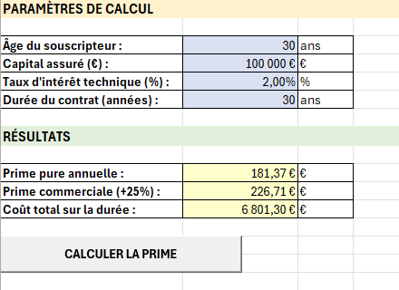
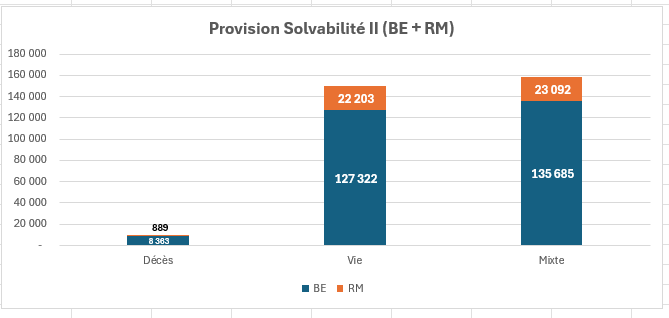

## Automatisation et Modélisation actuarielle – Assurance Décès (Excel + VBA)

**Construction d'une table de mortalité, calcul de primes pures, estimation des provisions techniques, et évaluation SCR d’un contrat décès (Solvabilité II – Pilier 1).**  

Outil développé sous **Excel VBA** à partir des **données INSEE (TD 2025, Homme, France)**.

<div align="center">
  
  
</div>

---
### 🎯 Objectif du projet

L’assurance décès repose sur un risque intrinsèquement incertain (date du sinistre, coût).  
Ce projet vise à **automatiser la chaîne actuarielle complète** :

**Données INSEE → Table de mortalité → Prime pure → Best Estimate → Risk Margin → Provision S2 → SCR/MCR & ratios**

L’objectif est de proposer un modèle **structuré, paramétrable et auditable**, développée sous Excel avec automatisation VBA, réduisant les manipulations manuelles (risque d’erreur, lenteur, difficulté d’audit).

---
### **Contexte : Pourquoi ce projet ?**

En assurance décès, **l’assureur s’engage à verser un capital en cas de décès**, mais ne connaît ni la date du sinistre ni son coût réel. **La prime pure est au cœur du problème** : c’est le **coût technique du risque**, calculé comme la **valeur actuelle des engagements futurs** (capital × probabilité de décès à chaque âge), **sans marge ni frais**.

**Sans une tarification précise, deux risques majeurs apparaissent** :
- **Sous-tarification** → Les cotisations ne couvrent pas les sinistres (pertes financières).
- **Sur-tarification** → Les clients fuient vers la concurrence (perte de parts de marché).

Pour éviter cela, **les normes Solvabilité II et IFRS 17 imposent aux assureurs de calculer cette prime pure à partir d’une table de mortalité fiable**, tout en justifiant leurs hypothèses auprès des régulateurs.

**Problème** : Les outils actuels (Excel manuel, scripts non documentés) sont lents, sources d’erreurs et difficiles à auditer.

---


### Fonctionnalités clés

| Fonctionnalité | Description | Exemple d’utilisation (dans le projet) |
|---|---|---|
| **Import automatique INSEE (TD 2025)** | Import et consolidation des données **INSEE TD 2025** (CSV) dans la feuille `Données_Brutes` (âges 0–120), prêtes pour les calculs. | Charger la table **TD 2025 – Homme (France)** pour alimenter automatiquement `Données_Brutes`. |
| **Construction de la table de mortalité** | Génération de la feuille `Table_Mortalité` avec les colonnes actuarielles usuelles : \( q_x \), \( p_x \), \( l_x \), \( d_x \), \( L_x \), \( T_x \), \( e_x \). Remplissage via bouton/macro. | Cliquer sur **“Remplir les formules”** pour obtenir une table prête pour la tarification et le provisionnement. |
| **Contrôles qualité (QA) intégrés** | Tests simples et auditables : bornes \( 0 \le q_x \le 1 \), cohérence \( p_x = 1 - q_x \), \( d_x = l_x \cdot q_x \), chaînage \( l_{x+1} = l_x - d_x \), monotonicité de \( l_x \), etc. | Détecter rapidement un mauvais import (décimal/%), un décalage d’âge, des lignes manquantes ou une incohérence de formules. |
| **Tarification : calcul de prime pure** | Calcul de la **prime pure** d’un contrat décès via actualisation des flux probabilisés (hypothèse standard : décès en **milieu d’année**). Feuille `Prime_Pure` + tableau multi-âges + graphique. | Calculer la prime pour **30 ans**, **100 000 €**, **durée 30 ans**, **taux 2%**, puis visualiser l’évolution par âge (ex. 20–60 ans). |
| **Provisions techniques (vision Solvabilité II)** | Calcul du **Best Estimate (BE)**, de la **Risk Margin** (approche **Cost of Capital – CoC = 6%**), puis de la **Provision S2 = BE + RM** dans `Provisions_Techniques et Solvabilité`. | Sur le cas principal **(Homme 40 ans, 200 000 €, 20 ans, taux 2%)**, obtenir **BE / RM / Provision S2** à la souscription *(t = 0, Janvier 2026)*. |
| **Solvabilité II – Pilier 1 (SCR / MCR)** | Estimation du **SCR** (modules : mortalité, longévité, rachat + agrégation) et du **MCR**, puis calcul des **ratios de couverture** : \( \frac{FP}{SCR} \) et \( \frac{FP}{MCR} \). | Avec **FP = 25 000 €**, afficher **Ratio SCR** et **Ratio MCR** et conclure sur la conformité. |
| **Comparaison Décès / Vie / Mixte** | Paramètre **Type de contrat** (Décès / Vie / Mixte) : les cashflows projetés, le BE, la RM et le SCR s’adaptent au profil de garantie. | Comparer les résultats et montrer l’impact sur **provisions** et **solvabilité** selon le type de garantie. |
| **Visualisations automatiques** | Graphiques démographiques ( \( l_x \), \( q_x \), \( e_x \), \( d_x \) ) et solvabilité (décomposition SCR, ratios SCR/MCR) dans la feuille `Graphiques`. | Mettre à jour les graphiques après recalcul pour analyser rapidement la mortalité et les indicateurs de solvabilité. |
---
### **📂 Structure du projet**

```
.
├── Documentation/
│   └── PROJET Actuariat 2026 VS final.docx
├── Modèle Excel/
│   └── Prime_Solvabilite VersionFinal.xlsm
├── Graphs/                
│   ├── Esperance de vie France2025.PNG
│   ├── Nbre Deces par age France 2025.PNG
│   ├── Provision_technique.PNG  (ou Technique de provisionnement.PNG)
│   └── bouton_prime_pure.PNG
├── VBA_Code/                   
│   ├── Creation_Prime_Pure.bas
│   ├── Creer_Graphiques_Mortalite.bas
│   ├── Creer_Table_Mortalite.bas
│   ├── Import_Données.bas
│   ├── Importer_Donnees_INSEE_2025.bas
│   └── Remplir_Formules_Table_M.bas
├── data/
├── Video de presentation projet
└── README.md

```

---
### 📌 Périmètre (cas d’étude principal)

**Produit :** Contrat décès temporaire (20 ans)  
- Assuré : **Homme 40 ans** (table **TD 2025 INSEE**)  
- Capital garanti : **200 000 €** (versé si décès pendant 20 ans)  
- Prime : **prime unique 5 234 €** à la souscription  
- Taux d’actualisation : **2%**  
- Fonds propres disponibles : **25 000 €**  
- Risk Margin : approche **Cost of Capital (CoC = 6%)**

**Modules SCR étudiés (simplifiés) :**
- Mortalité (choc **+15%**)
- Longévité (choc **-20%**)
- Rachat (rachats massifs **5%**)
- Marché / contrepartie / opérationnel : **hors périmètre**

---

### ✅ Résultats clés (Décès temporaire) — à la souscription *(t = 0, Janvier 2026)*

Sur le cas d’étude (Homme 40 ans, capital 200 000 €, durée 20 ans, prime unique 5 234 €, taux 2%), le modèle aboutit aux résultats suivants à la souscription *(t = 0)* :

- **Best Estimate (BE)** : **8 363 €**
- **Risk Margin (CoC 6%)** : **889 €**
- **Provision Solvabilité II (BE + RM)** : **9 252 €**
- **SCR total agrégé** : **2 069 €**
  - Mortalité : **1 388 €**
  - Longévité : **1 850 €**
  - Rachat : **463 €**
- **MCR** : **517 €**
- **Fonds propres** : **25 000 €**
  - **Ratio SCR = 1 208,4%** (conforme)
  - **Ratio MCR = 4 833,8%** (conforme)

Conclusion : les fonds propres (25 000 €) sont largement supérieurs au capital requis (SCR 2 069 €) → **situation conforme**.

---

### 📊 Synthèse comparative (Décès / Vie / Mixte)

Les trois scénarios sont évalués sur une base commune (âge 40, durée 20, capital 200 000 €, prime 5 234 €, taux 2%, CoC 6%, FP 25 000 €).

| Type | Best Estimate | Risk Margin | Provision S2 | SCR total | MCR | Ratio SCR | Ratio MCR |
|---|---:|---:|---:|---:|---:|---:|---:|
| **Décès** | 8 363 € | 889 € | 9 252 € | 2 069 € | 517 € | 1 208,4% | 4 833,8% |
| **Vie** | 127 322 € | 22 203 € | 149 526 € | 33 435 € | 8 359 € | 74,8% *(non conforme)* | 299,1% |
| **Mixte** | 135 685 € | 23 092 € | 158 778 € | 35 504 € | 8 876 € | 70,4% *(non conforme)* | 281,7% |

le produit **Décès** est peu provisionnant / peu consommateur de capital, tandis que **Vie** et **Mixte** nécessitent davantage de fonds propres (ratio SCR < 100% avec FP = 25k€).

---

## 🧱 Données & méthode

### Source de données
- Tables de mortalité **INSEE TD 2025** (Homme, France)
- Variables exploitées : \( l_x, q_x, d_x, e_x \) (granularité annuelle, âges 0 à 120)

### Principe général
- Actualisation au taux \( i \), avec \( v = \frac{1}{1 + i} \)
- Hypothèse : **décès en moyenne en milieu d’année** (actualisation en \( t + 0.5 \))

---

### Architecture Excel (5 feuilles)

1. **Données_Brutes**  
   Stockage consolidé des données INSEE importées via macro.

2. **Table_Mortalité**  
   Table nettoyée et exploitable : age, \( q_x \), \( p_x \), \( l_x \), \( d_x \), etc.

3. **Prime_Pure**  
   Calcul des primes pures (outil de tarification + tableau multi-âges + graphique).

4. **Graphiques**  
   Graphiques démographiques (lx, qx, ex, dx) + solvabilité (SCR, ratios).

5. **Provisions_Techniques et Solvabilité**  
   Calcul **BE**, **RM (CoC)**, **Provision S2**, **SCR**, **MCR**, ratios.

---

### 🛠️ Guide d’utilisation

#### 1️⃣ Prérequis
- **Excel 2016+** (macros activées)
- **CSV INSEE TD 2025** (taux par âge) dans `Data/`

#### 2️⃣ Installation
1. Télécharger le repo (ZIP ou `git clone`)
2. Ouvrir `Prime_Solvabilite VersionFinal.xlsm` → **Activer les macros**

#### 3️⃣ Workflow (pas à pas)
1. **Importer INSEE**
   - Feuille `Données_Brutes` → bouton **Importer données INSEE**
   - Sélectionner le CSV (ex. `Data/TD2025_Hommes.csv`)

2. **Construire la table**
   - Feuille `Table_Mortalité` → bouton **Remplir les formules** / **Générer la table**
   - Colonnes calculées : \( qx \), \( px \), \( lx \), \( dx \), \( Lx \), \( Tx \), \( ex \)

3. **Calculer la prime pure**
   - Feuille `Prime_Pure` → saisir **Âge**, **Capital**, **Durée**, **Taux**
   - Bouton **Calculer la prime**

4. **Solvabilité II**
   - Feuille `Provisions_Techniques et Solvabilité` → lancer le calcul
   - Sorties : **BE**, **RM (CoC 6%)**, **Provision S2**, **SCR**, **MCR**, **ratios FP/SCR & FP/MCR**
---


### ▶️ Utilisation (Excel VBA)

1. Ouvrir le fichier `.xlsm`
2. **Activer les macros**
3. Importer / mettre à jour les données INSEE via bouton/macro
4. Lancer les calculs (prime / provisions / solvabilité)
5. Consulter tableaux & graphiques (onglets dédiés)

---

### ⚠️ Limites

- Taux d’actualisation **constant** (2%)
- SCR en approche **simplifiée** (formule standard simplifiée)
- Hors périmètre : marché, contrepartie, opérationnel
- Pas de projection dynamique des primes futures
- Hypothèse décès milieu d’année

---

### 🚀 Améliorations possibles

- Courbe des taux sans risque (term structure)
- Modélisation stochastique de la mortalité
- Ajout du module marché / ALM simplifié
- Simulation Monte Carlo, approche ORSA

---

### **🤝 Contribuer**

Vous souhaitez améliorer ce projet ?
1. **Forkez** le dépôt (`git fork`).
2. **Créez une branche** (`git checkout -b feature/ma-fonctionnalite`).
3. **Commitez vos changements** (`git commit -m "Ajout de la fonction X"`).
4. **Pushez** (`git push origin feature/ma-fonctionnalite`).
5. **Ouvrez une Pull Request** pour revue.
---
## **📧 Contact**
Pour toute question ou suggestion :
📩 [votre.email@example.com](jordanjatsa@gmail.com)
🔗 [LinkedIn](https://www.linkedin.com/in/jordan-jatsa-lekane/)

--
